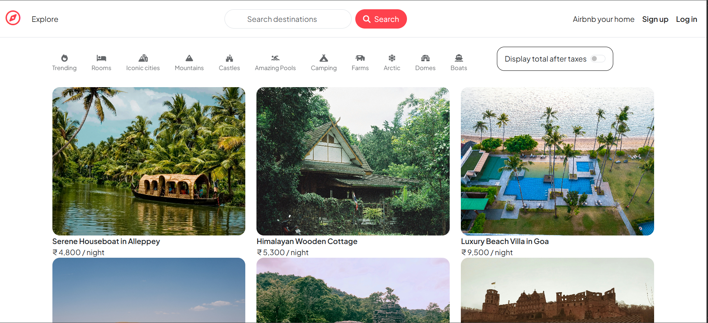
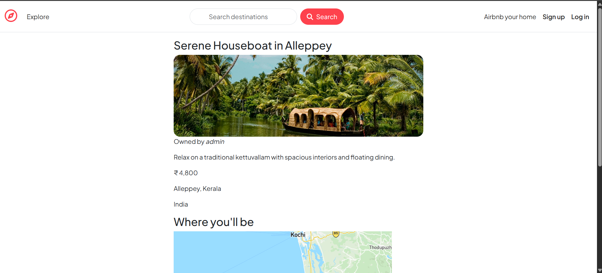
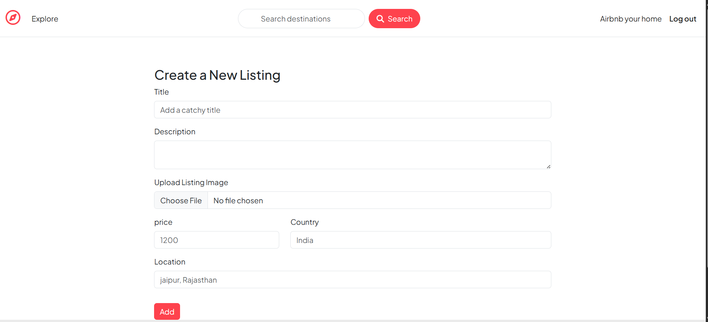

# delta-project
This is our major project - Wanderlust
# 🌍 WanderLust

> A full-stack Airbnb-inspired platform to explore, list, and review unique stays across India and beyond.

[](https://nodejs.org/)
[](https://expressjs.com/)
[](https://www.mongodb.com/)
[](https://getbootstrap.com/)

---

## 📸 Screenshots

| Explore Listings | Listing Detail |
|:---:|:---:|
|  |  |

| Create a Listing |
|:---:|
|  |

> **Note:** Replace the paths above with your actual screenshot filenames after adding them to a `screenshots/` folder in the repo.

---

## ✨ Features

- 🔐 **Authentication & Authorization** — Secure sign-up/login via `passport.js`. Users can only edit or delete their own listings and reviews.
- 🗺️ **Interactive Maps** — Real-world property locations rendered with **Mapbox GL JS** and forward geocoding.
- 📸 **Image Uploads** — Seamless property image storage via **Cloudinary**.
- ⭐ **Review System** — Authenticated users can leave 1–5 star ratings with written comments.
- 🏡 **Full CRUD** — Create, read, update, and delete listings and reviews through a RESTful API.
- 💬 **Flash Messages** — Real-time UI feedback for login, errors, and success events.
- 🔒 **Session Management** — Secure, MongoDB-backed session storage.

---

## 🛠️ Tech Stack

| Layer | Technology |
|---|---|
| **Frontend** | HTML5, CSS3, Bootstrap 5, EJS, EJS-Mate |
| **Backend** | Node.js, Express.js |
| **Database** | MongoDB, Mongoose |
| **Authentication** | Passport.js (`passport-local`, `passport-local-mongoose`) |
| **Cloud Storage** | Cloudinary (`multer-storage-cloudinary`) |
| **Maps** | Mapbox GL JS, `@mapbox/mapbox-sdk` |
| **Validation** | Joi |

---

## 🚀 Getting Started

### Prerequisites

Make sure you have the following installed and ready:

- [Node.js](https://nodejs.org/) (v18 or above recommended)
- [MongoDB](https://www.mongodb.com/try/download/community) running locally, or a [MongoDB Atlas](https://www.mongodb.com/atlas) URI
- Free API accounts on [Cloudinary](https://cloudinary.com/) and [Mapbox](https://www.mapbox.com/)

### Installation

**1. Clone the repository**
```bash
git clone https://github.com/<your-username>/WanderLust.git
cd WanderLust
```

**2. Install dependencies**
```bash
npm install
```

**3. Configure environment variables**

Create a `.env` file in the root directory:
```env
# Cloudinary — Image Storage
CLOUD_NAME=your_cloudinary_cloud_name
CLOUD_API_KEY=your_cloudinary_api_key
CLOUD_API_SECRET=your_cloudinary_api_secret

# Mapbox — Maps & Geocoding
MAP_TOKEN=your_mapbox_public_token

# MongoDB
ATLASDB_URL=your_mongodb_atlas_uri

# Express Session
SECRET=your_session_secret_string
```

**4. Start the development server**
```bash
node app.js
```

Open your browser and visit: **[http://localhost:8080](http://localhost:8080)**

---

## 📁 Project Structure

```
WanderLust/
├── controllers/        # Route handler logic
├── models/             # Mongoose schemas (Listing, Review, User)
├── routes/             # Express routers
├── views/              # EJS templates
│   ├── layouts/
│   ├── listings/
│   └── users/
├── public/             # Static assets (CSS, JS, images)
├── utils/              # Helper utilities & error handling
├── middleware.js        # Custom middleware (auth, validation)
├── cloudConfig.js       # Cloudinary configuration
├── app.js              # Entry point
└── .env                # Environment variables (not committed)
```

---

## 🗺️ Key Routes

| Method | Route | Description |
|---|---|---|
| GET | `/listings` | Browse all listings |
| GET | `/listings/new` | New listing form |
| POST | `/listings` | Create a listing |
| GET | `/listings/:id` | View listing details + map |
| PUT | `/listings/:id` | Update a listing |
| DELETE | `/listings/:id` | Delete a listing |
| POST | `/listings/:id/reviews` | Add a review |
| DELETE | `/listings/:id/reviews/:reviewId` | Delete a review |
| GET | `/signup` | Register page |
| GET | `/login` | Login page |
| GET | `/logout` | Logout |

---

## 🌐 Live Demo

> 🔗 [Add your deployed link here — e.g., Render / Railway / Vercel]

---

## 🤝 Contributing

Pull requests are welcome! For major changes, please open an issue first to discuss what you'd like to change.

---

## 📄 License

This project is licensed under the [MIT License](LICENSE).

---

<p align="center">Made with ❤️ by <a href="https://github.com/<your-username>"><strong>your-username</strong></a></p>
<p align="center">© WanderLust Private Limited</p>